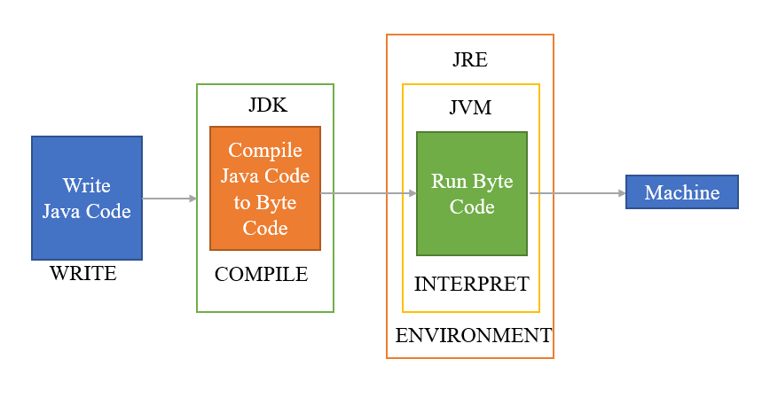

# Java Architecture :

- Origin of the java in 1991 called [GreenTalk] and    after renamed as the [Oak]
- Oak renamed as the Java in 1995.

# Goal of designing:

- Java is platform neutral language.
- Main aim was to remove the OS specific compiler.
- Away from the platform dependent.
- also Java is used to produce the platform neutral code.

# Java Virtual Machine :
- JVM is platform specific.
- The output of the java compiler is Bytecode.
- Bytecode are executed by the JVM.
- Interpreter responsible to convert the bytecode into machine specific and executes.
- Interpreted code runs slower than executable code.
- Use of Byte Code makes faster execution for JRE.
 
 # Class loader :
 - Class loader is the part of the JVM:
   - For security standpoint
   - Network mobility.
 - Class loader loads the compiled source file(.class file ) into the JVM. 
- Bootstrap class loader loads the classes , programmer defined classes as well as the java API class.

# MCQ:
## 1. Correct order of Java Code Execution :
1. Java source code
2. Compilation
3. ByteCode verification
4. Class Loader
5. Interpretation
6. Execution

## 2. Used to load a.class file?
- class Loader

## 3. When java program is compiled , it creates ?
- a.class file

## 4. JDK is the superset of the JRE along with development tools such as compiler, debugger, necessary for developing .
- TRUE
